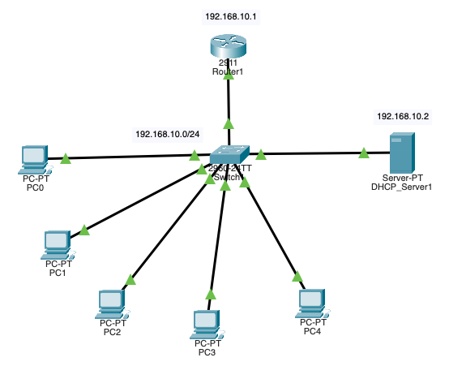

# Cisco Packet Tracer Project: DHCP Server Configuration

## **Overview**

This repository contains the configuration files for a basic network project created using Cisco Packet Tracer. The project demonstrates the setup of a DHCP server to dynamically assign IP addresses to PCs within a local area network (LAN). It includes configurations for a router, a switch, a dedicated DHCP server, and several PCs.

---

## Network Diagram

---

## **Project Details**

- **Network Topology**: Includes one router, one switch, one DHCP server, and four PCs.
- **Configurations**: Contains configuration files for the router, switch, DHCP server, and PCs.
- **Purpose**: Designed to showcase DHCP server configuration and its role in dynamic IP address assignment within a network.

---

## **Files Included**

- [Network Topology](network_topology.pkt): Cisco Packet Tracer file with the network design and configuration.
- [Router1 Configuration](configs/router1_config.md): Configuration commands used on the router.
- [Switch1 Configuration](configs/switch1_config.md): Configuration commands used on the switch.
- [DHCP_Server1 Configuration](configs/dhcp_server1_config.md): Configuration steps for the DHCP server.
- [Requirements](requirements.md): Detailed requirements and specifications for the project.

---

## **How to Use**

1. **Open the Packet Tracer File**: Download and open [Network Topology](network_topology.pkt) using Cisco Packet Tracer.
2. **Review Configurations**: Examine [Router1 Configuration](configs/router1_config.md), [Switch1 Configuration](configs/switch1_config.md), and [DHCP_Server1 Configuration](configs/dhcp_server1_config.md) for detailed configuration commands and steps.
3. **Understand Project Requirements**: Refer to [Requirements](requirements.md) to understand the complete project requirements and specifications.

---

## **Goals**

- Demonstrate the configuration and role of a DHCP server in a network.
- Provide a practical example of dynamic IP address assignment.
- Serve as a reference for configuring DHCP and integrating it with network devices.

---
